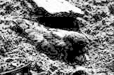

# 應用程式設計 - 課後實作 07

## 問題描述
用直方圖來統計單一圖片中不同像素值的數量，並以像素值為横軸、像素數量為縱軸來繪製圖表。圖片的直方圖統計如集中在特定範圍將使圖片看起過暗或是過亮。  
請設計一程式可以自動調整過亮或過暗的圖片(圖1)，使圖片中的物件可以明顯呈現 (圖2) 。此程式需可以讀入指定檔案、轉成灰階圖、調整像素值、將調整後的圖片另存新檔，同時顯示調整前後的直方圖 (圖3) 於螢幕上。


### 圖1 - Q10.jpg
](images/Q10.jpg)
### 圖2 - Q10_ans.jpg
](images/Q10_ans.jpg)
### 圖3 - 直方圖
](images/histogram.png)

## 目錄結構
```bash
Assignment_07/
│
├─ images/
│  ├─ Q10.jpg
│  ├─ Q10_ans.jpg
│  └─ histogram.png
│
├─ Assignment_07.py
└─ README.md
```