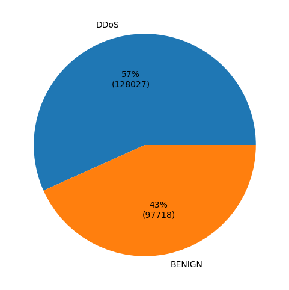
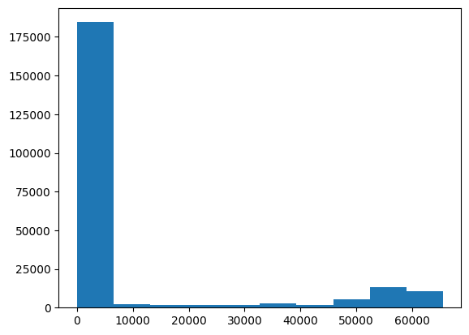
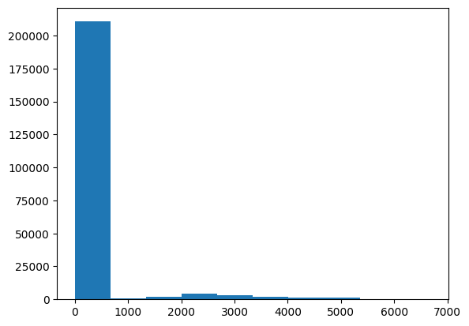

# 應用程式設計 - 課後實作 08
網路流量資料集如附件 (CICIDS2017.csv)，請利用 Python + Pandas 讀入資料表並完成下列統計圖。
## 問題描述 - 1
顯示正常流量與 DDoS 流量占比與數量的圓餅圖。

## 問題描述 - 2
顯示統計 Destination Port 分布的直方圖。

## 問題描述 - 3
顯示統計 Forward packet length 分布的直方圖。

## 問題描述 - 4
顯示橫軸是 Dst Port，縱軸是正常流量的 Average Packet Size (紅色)、標準差(綠色)以及異常流量的 Average Packet Size (黃色)、標準差(藍色)。  

## 問題描述 - 5
顯示橫軸是 Dst Port，縱軸是正常流量的 Fwd Packets/s (紅色)、標準差(綠色)以及異常流量的 Fwd Packets/s (黃色)、標準差(藍色)。  

※ 4 跟 5 老實說我看不懂題目要表達的意思
