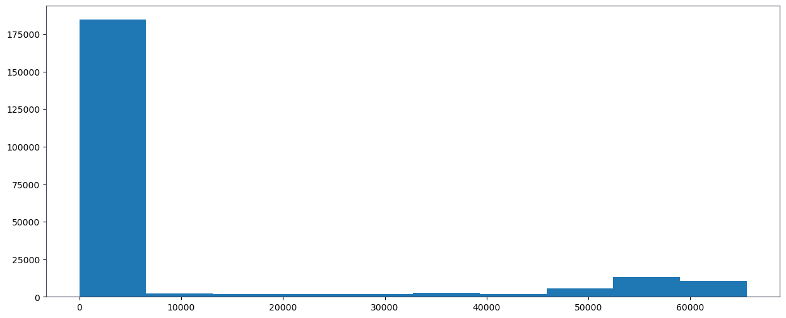
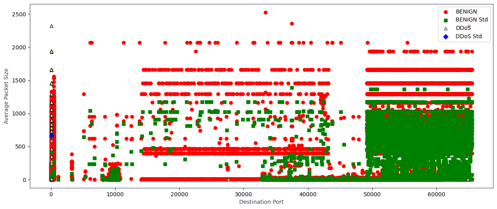
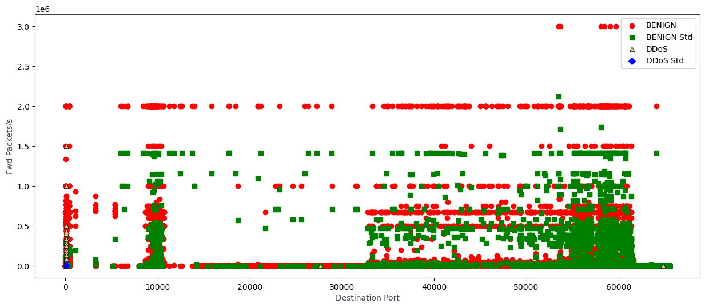

# 應用程式設計 - 課後實作 08
請讀入附件 (CICIDS2017.csv) 並完成下列統計圖。
## 問題描述 - 1
顯示正常流量與 DDoS 流量占比與數量的圓餅圖。

## 問題描述 - 2
顯示統計 Destination Port 分布的直方圖。

## 問題描述 - 3
顯示統計 Forward packet length 分布的直方圖。

## 問題描述 - 4
顯示橫軸是 Destination Port，縱軸是正常流量的 Average Packet Size 和其標準差，以及 DDoS 流量的 Average Packet Size 和其標準差。 

## 問題描述 - 5
顯示橫軸是 Destination Port，縱軸是正常流量的 Fwd Packets/s 和其標準差，以及 DDoS 流量的 Fwd Packets/s 和其標準差。 


※ 4 和 5 的顏色設定依序為: 紅色、綠色、黃色、藍色，這兩題我不確定是否正確🤨。

## 目錄結構
```bash
Assignment_08/
│
├─ data/
│  └─ CICIDS2017.csv
│
├─ images/
│  ├─ image0.png
│  ├─ image1.png
│  ├─ image2.png
│  ├─ image3.png
│  └─ image4.png
│
├─ notebooks/
│  └─ Assignment_08.ipynb
│
└─ README.md
```
